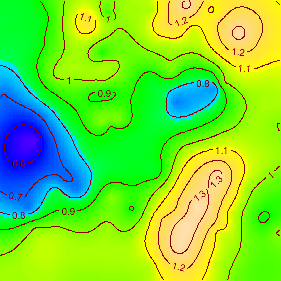

# SpatDiv

Spatially Explicit Measures of Diversity

This is a preliminary version of a package designed to measure spatially-explicit diversity.

Refer to the [introduction vignette](https://EricMarcon.github.io/SpatDiv/Introduction.html)