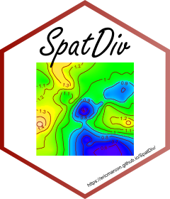

# SpatDiv 

Spatially Explicit Measures of Diversity

This is a preliminary version of a package designed to measure spatially-explicit diversity.

Refer to the [Vignette](https://EricMarcon.github.io/SpatDiv/)